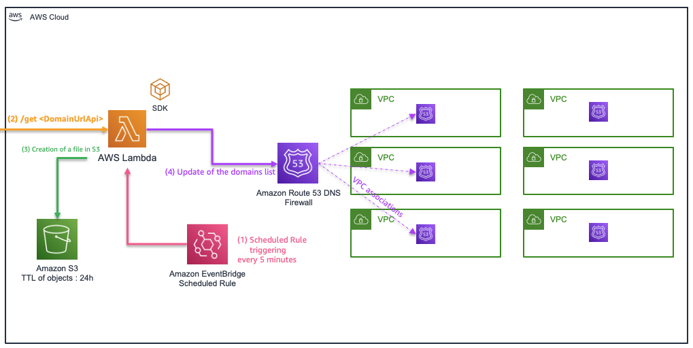
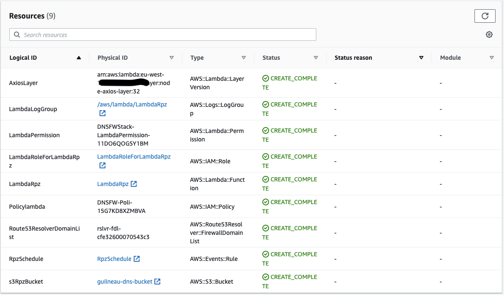

## Amazon Route 53 Resolver DNS Firewall Automation
Please find a collection of scripts, codes and samples that demonstrate how you can automate the updating of a domain list from Route 53 DNS Firewall.
To go further with the solution and for more flexibility : https://github.com/aws-samples/route53resolver-dns-firewall-automation-bring-your-own-lambda

**Architecture principles**


**With this template, you will deploy the following resources :**

- 1 Scheduled rule (eventbridge) that will invoke a lambda every 5 minutes
- 1 Lambda that will fetch the malicious url from a trusted source : https://urlhaus.abuse.ch/downloads/rpz/
- 1 Lambda layer that contains the axios package that is used as a wrapper to fetch the list of domains
- 1 Lambda log group that will contains the logs from the deployed lambda
- 1 Lambda permission to authorize eventbridge to call the deployed lambda
- 1 IAM Role associated to the lambda
- 1 IAM Policy associated with the lambda's role
- 1 S3 bucket that will be used in order to "bulk import" the domains into route53dns firewall
- 1 Route53resolver domains list that will be kept up to date by the automation process



**Before deploying :**
- Create the "node-axios-layer" package : you can use the script "build-layer.sh"
- Create an s3 bucket : <-ParamS3ArtifactBucket->
- Upload the lambda functions as a zipfile to the s3 bucket : you can use the script "zipupload.sh" 
- Upload the "node-axios-layer" to the s3 bucket : you can use the script "zipupload.sh"
- Create a rule mapping to your domain and a vpc association if you want the dns filtering to be in place.


(1) From the layer folder : ```. ./build-layer.sh```

(2) From the dist folder : ```. ./zipupload.sh <ParamS3ArtifactBucket>```

**To deploy :** 

With the aws-cli : ``` aws --region <region> cloudformation create-stack --stack-name DNSFWStack --capabilities CAPABILITY_NAMED_IAM --template-body file://./DNSFWStack.cfn.yaml --parameters ParameterKey=ParamS3ArtifactBucket,ParameterValue=<-ParamS3ArtifactBucket-> ParameterKey=ParamS3RpzBucket,ParameterValue=<DNSFW-bucket-name> ParameterKey=ParamFirewallDomainListName,ParameterValue=<DomainListName>```

**To delete :**

With the cli : ```aws s3 rm s3://<DNSFW-bucket-name> --recursive && aws --region <region> cloudformation delete-stack --stack-name DNSFWStack```

**Note :**
- The retention policy on the "ParamS3RpzBucket" that will be created is set to 24h
- The log group of the lambda is set to retain log for a duration of 1 month
- You can monitor the lambda executions from the cloudwatch logs and the lambda "monitor" pannel

## Security

See [CONTRIBUTING](CONTRIBUTING.md#security-issue-notifications) for more information.

## License

This library is licensed under the MIT-0 License. See the LICENSE file.
